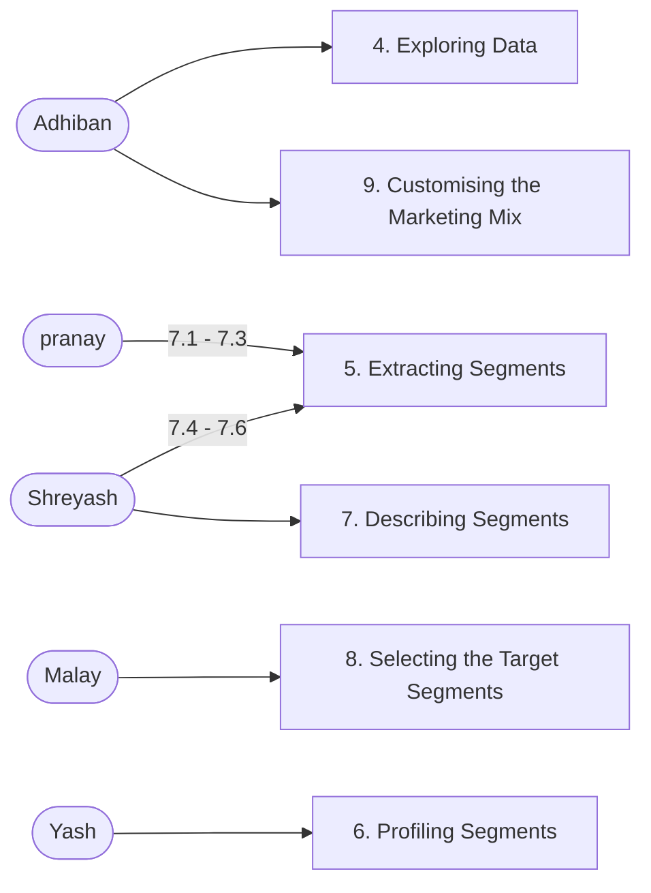

# Market Segmentation Analysis - [Feynn Labs](https://www.linkedin.com/company/feynn-labs/?originalSubdomain=in) [Internship](https://feynnlabs.com/internships/)

## Team members
- Adhiban Siddarth (Me) [Team Lead]
- Karakavalasa venkata pranay 
- Malay Vyas ([Project link](https://github.com/MalayVyas/Feynn_Labs))
- Shreyash Banduji Chacharkar
- Yash Mayur ([Project link](https://github.com/ysmayur1992/Feynn_Labs_Project2))

## Study

10 days study period (Aug 15 - Aug 24)

> [McDonalds dataset](https://homepage.boku.ac.at/leisch/MSA/datasets/mcdonalds.csv) 
> [Market Segmentation Analysis PDF](https://drive.google.com/file/d/1SIEt4Bp_4R9dcs4saU1DIui1IKWQIW38/view)

### Market Segmentation steps

1. Deciding (not) to Segment
2. Specifying the Ideal Target Segment
3. Collecting Data
4. Exploring Data
5. Extracting Segments
6. Profiling Segments
7. Describing Segments
8. Selecting (the) Target Segment(s)
9. Customising the Marketing Mix

### Steps splitup

### Files

- [summary.md](summary.md): Summarizing the assigned steps
- [McDonalds-Case-Study.ipynb](McDonalds-Case-Study.ipynb): Python code practice of entire case study

### Schedule

|Date|What to do|
|:---:|---|
|Aug 15 - Aug 19|Summarizing the steps|
|Aug 19|Upload Summary in GitHub|
|Aug 21|Meeting|
|Aug 20 - Aug 23|McDonalds Case Study|
|Aug23|Upload McDonalds Case Study in GitHub and Meeting|
|Aug 23 - Aug 25|I will make submission report from our summaries and codes|
|Aug 25|Report submission date| 

## Team members info
- Adhiban Siddarth
    - 7708026443
    - siddhu1131@gmail.com | [LinkedIn](https://www.linkedin.com/in/adhiban-siddarth-v-1a328522b/) | [GitHub](https://github.com/Adhiban1)
    - Skills:
        - Statistics | Probability | Calculus | Linear Algebra | Convex Optimization | High Dimensional Geometry | Mathematical Series | Numpy | Pandas | Matplotlib | Scikit Learn | Tensorflow | NLTK | Anaconda | Jupyter Notebook | Pycharm | Google Collab Python | Data Collection (Googling) | Exploratory Data Analysis (EDA) | Data Pre-processing | Feature Transformation | Feature Selection | Model Building from Scratch | Model Tuning | Hyper-parameter tuning
- Karakavalasa venkata pranay 
    - 8374035709
    - pranaykarakavalasa@gmail.com | [LinkedIn](https://www.linkedin.com/in/venkata-pranay-karakavalasa-3b81b123b) | [GitHub](https://github.com/Venkatapranay/)
    - Skills:
        - Statistics | Calculus | Linear Algebra | Mathematical Series | Numpy | Pandas | Matplotlib | Scikit Learn | Jupyter Notebook | Google Collab | Python | Exploratory Data Analysis (EDA) | Data Pre-processing
- Malay Vyas 
    - 7778029983
    - malayvyas2004@gmail.com | [LinkedIn](https://www.linkedin.com/in/malay-vyas-7b58b4227) | [GitHub](https://github.com/MalayVyas) | [YouTube](https://www.youtube.com/@malay.01)
    - Skills:
        - Calculus | Linear Algebra | Mathematical Series | Numpy;Pandas | Matplotlib | Scikit Learn | Tensorflow | Anaconda | Jupyter Notebook | Pycharm | Google Collab | Python | Data Collection (Googling) | Exploratory Data Analysis (EDA) | Data Pre-processing | Feature Transformation | Feature Selection | Model Building from Scratch					
- Shreyash Banduji Chacharkar
    - 7385228663
    - shreyashc2911@gmail.com | [LinkedIn](https://www.linkedin.com/in/shreyash-chacharkar-i) | [GitHub](https://github.com/ShreyashChacharkar)
    - Skills: 
        - Statistics | Probability | Calculus | Linear Algebra | Mathematical Series | Numpy | Pandas | Matplotlib | Scikit Learn | NLTK | Anaconda | Jupyter Notebook | Spyder | Pycharm | Google Collab | Python | Data Collection (Googling) | Exploratory Data Analysis (EDA) | Data Pre-processing | Feature Transformation | Feature Selection | Model Building from Scratch | Model Tuning | Hyper-parameter tuning
- Yash Mayur
    - 9503546080
    - ysmayur1992@gmail.com | [LinkedIn](https://www.linkedin.com/in/yash-mayur-4659591b/) | [YouTube](https://www.youtube.com/@Ysmayur1992) | [GitHub](https://github.com/ysmayur1992)
    - Skills: 
        - Statistics | Probability | Calculus | Linear Algebra | Convex Optimization | High Dimensional Geometry | Mathematical Series | Numpy | Pandas | Matplotlib | Scikit Learn | Tensorflow | Pytorch | NLTK | Anaconda | Jupyter Notebook | Pycharm | Google Collab | Python | Data Collection (Googling) | Exploratory Data Analysis (EDA) | Data Pre-processing | Feature Transformation | Feature Selection | Model Building from Scratch | Model Tuning | Hyper-parameter tuning

